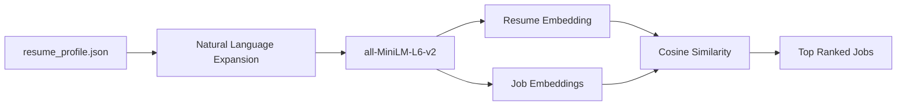

# 🎯 AI Job Newsletter Agent — Phase 2.1

<div align="center">


### AI-powered career intelligence system for automated job discovery, semantic ranking, ATS analysis, recruiter evaluation, and resume optimization.

</div>

---

## 🚀 Features

- ✅ Scrapes fresh LinkedIn jobs posted in the last **12 hours**
- ✅ Supports multiple locations: Pune · Bangalore · Hyderabad · Remote India
- ✅ **Semantic similarity ranking** using local `all-MiniLM-L6-v2` embeddings (zero API cost)
- ✅ **Resume parsed from PDF** — no hardcoded summaries
- ✅ **AI scoring** using Groq (`llama-3.1-8b-instant`) on top-N semantically ranked jobs only
- ✅ **Three-actor intelligence layer** per qualifying job:
  - 🔬 **Diagnoser** — ATS score, missing keywords, weak/strong areas
  - 👔 **Recruiter** — role fit score, commonly required gaps, quick wins
  - ✍️ **Rewriter** — tailored resume rewrite using Google XYZ formula
- ✅ Smart filtering removes senior roles, wrong tech stacks, irrelevant domains
- ✅ **Resume profile cached** — only regenerates when `REGENERATE_RESUME=true`
- ✅ Experience level and seniority stored in secrets — immune to freelance/consulting inflation
- ✅ Beautiful HTML email newsletter with intelligence sections inline
- ✅ Fully serverless via GitHub Actions · Runs twice daily · ~₹0/month

---

# 🏗️ System Architecture

```mermaid
flowchart TD

    %% ===================== STYLES =====================
    classDef scheduler fill:#0f172a,color:#ffffff,stroke:#38bdf8,stroke-width:3px;
    classDef resume fill:#111827,color:#ffffff,stroke:#818cf8,stroke-width:3px;
    classDef scraping fill:#052e16,color:#ffffff,stroke:#4ade80,stroke-width:3px;
    classDef filtering fill:#3f2b05,color:#ffffff,stroke:#facc15,stroke-width:3px;
    classDef embedding fill:#312e81,color:#ffffff,stroke:#a78bfa,stroke-width:3px;
    classDef llm fill:#4a044e,color:#ffffff,stroke:#f472b6,stroke-width:3px;
    classDef intelligence fill:#082f49,color:#ffffff,stroke:#22d3ee,stroke-width:3px;
    classDef delivery fill:#052e16,color:#ffffff,stroke:#34d399,stroke-width:3px;

    %% ===================== FLOW =====================

    A["⚡ GitHub Actions Scheduler<br/><br/>Runs at 8 AM & 8 PM IST"]:::scheduler

    B["📄 Resume Intelligence Layer<br/><br/>
    • resume_parser.py<br/>
    • resume_profile.py<br/>
    • Cached resume_profile.json<br/>
    • Conditional regeneration"]:::resume

    C["🔎 Job Collection Layer<br/><br/>
    • LinkedIn Search URLs<br/>
    • Apify LinkedIn Scraper<br/>
    • Raw Job Dataset"]:::scraping

    D["🧹 Filtering & Cleanup Layer<br/><br/>
    • Deduplication<br/>
    • Seniority Filtering<br/>
    • Tech Stack Exclusions<br/>
    • Relevance Keyword Filtering"]:::filtering

    E["🧠 Semantic Ranking Engine<br/><br/>
    • all-MiniLM-L6-v2<br/>
    • Query Expansion<br/>
    • 384-dim Embeddings<br/>
    • Cosine Similarity Ranking<br/>
    • Top 10 Jobs"]:::embedding

    F["🤖 Groq LLM Intelligence<br/><br/>
    • Compatibility Scoring<br/>
    • Match Verdicts<br/>
    • Skill Gap Detection<br/>
    • Experience Alignment"]:::llm

    G["🎯 Three-Actor Intelligence Layer<br/><br/>
    🔬 Diagnoser → ATS Analysis<br/><br/>
    👔 Recruiter → Hiring Evaluation<br/><br/>
    ✍️ Rewriter → Tailored Resume Optimization"]:::intelligence

    H["📬 Newsletter Delivery Layer<br/><br/>
    • HTML Email Builder<br/>
    • Resend / SendGrid<br/>
    • Inbox Delivery"]:::delivery

    %% ===================== CONNECTIONS =====================

    A --> B
    B --> C
    C --> D
    D --> E
    E --> F
    F --> G
    G --> H
```

<div align="center">



</div>

---

## 📂 Project Structure

```text
.
├── job_agent.py              # Main orchestration pipeline
├── email_sender.py           # HTML newsletter builder + delivery
├── embedder.py               # Semantic similarity engine
├── resume_parser.py          # PDF text extraction utility
├── resume_profile.py         # Resume → structured profile generator
├── resume_profile.json       # Cached AI-generated profile
├── requirements.txt
├── resumes/
│   └── latest_resume.pdf
└── .github/
    └── workflows/
        └── job_newsletter.yml
```

---

# ⚙️ How It Works

## 1️⃣ Resume Intelligence Generation

- Resume PDF is parsed locally
- Structured candidate profile generated using Groq
- Profile cached as `resume_profile.json`
- Regenerated only when needed

---

## 2️⃣ LinkedIn Job Collection

- LinkedIn search URLs are queried through Apify
- Fresh jobs from the last 12 hours are collected
- Multiple cities + remote jobs supported

---

## 3️⃣ Filtering Pipeline

The pipeline removes:

- Senior roles
- Irrelevant tech stacks
- Duplicate jobs
- Non-target domains

This significantly reduces unnecessary LLM calls.

---

## 4️⃣ Semantic Ranking

`all-MiniLM-L6-v2` creates embeddings for:

- Resume profile
- Every filtered job description

Jobs are ranked using cosine similarity.

Only the **Top 10 jobs** proceed to LLM scoring.

---

## 5️⃣ AI Intelligence Layer

Each shortlisted job receives:

### 🔬 Diagnoser

- ATS compatibility score
- Missing keywords
- Weak/strong resume areas

### 👔 Recruiter

- Hiring-fit analysis
- Missing industry expectations
- Quick-win recommendations

### ✍️ Rewriter

- Tailored experience rewrite
- Google XYZ formula optimization
- ATS keyword incorporation

---

## 6️⃣ Newsletter Generation

A polished HTML email newsletter is generated containing:

- Job cards
- Compatibility scores
- Skill gaps
- ATS insights
- Tailored resume sections
- Apply buttons

Delivered using:

- Resend
- SendGrid

---

# 🛠️ Setup

## Step 1 — Create Repository

Create a new **private GitHub repository** and upload the project files.

---

## Step 2 — Upload Resume

Place your resume here:

```text
resumes/latest_resume.pdf
```

---

## Step 3 — Get API Keys

| Service | Usage | Free Tier |
|---|---|---|
| Apify | LinkedIn scraping | 100 runs/month |
| Groq | LLM scoring | Free |
| Resend | Email delivery | 100 emails/day |
| SendGrid | Alternative email delivery | 100 emails/day |

---

## Step 4 — Configure GitHub Secrets

Go to:

```text
GitHub Repo → Settings → Secrets and variables → Actions
```

Add:

| Secret | Description |
|---|---|
| `APIFY_TOKEN` | Apify API token |
| `GROQ_API_KEY` | Groq API key |
| `RECIPIENT_EMAIL` | Your inbox |
| `SENDER_EMAIL` | Verified sender |
| `EMAIL_API_KEY` | Resend/SendGrid API key |
| `EMAIL_PROVIDER` | resend / sendgrid |
| `MIN_SCORE` | Minimum compatibility threshold |
| `TOP_N` | Max jobs in newsletter |
| `REGENERATE_RESUME` | true / false |
| `CANDIDATE_EXPERIENCE` | Actual experience |
| `CANDIDATE_SENIORITY` | junior / mid |

---

# ⏰ Schedule

Runs automatically:

- **8:00 AM IST**
- **8:00 PM IST**

```yaml
on:
  schedule:
    - cron: "30 2 * * *"
    - cron: "30 14 * * *"

  workflow_dispatch:
```

---

# 🧠 Embedding Pipeline



---

# 🔍 Filtering Logic

## Seniority Filter

Excluded title keywords:

```text
senior · sr. · lead · principal · architect
manager · director · vp · head of
```

---

## Tech Stack Exclusions

```text
java · spring · springboot · .net · php
android · ios · react native
golang · ruby on rails
```

---

## Required Keywords

```text
python · fastapi · backend
data engineer · databricks
kafka · pyspark · azure
postgresql · etl
```

---

# 💰 Estimated Monthly Cost

| Service | Estimated Cost |
|---|---|
| GitHub Actions | Free |
| Apify | Free |
| Groq | Free |
| Resend / SendGrid | Free |
| Local Embeddings | Free |
| **Total** | **~₹0/month** |

---

# 🧱 Tech Stack

| Layer | Technology |
|---|---|
| Scraping | Apify |
| Embeddings | sentence-transformers |
| LLM | Groq |
| PDF Parsing | PyMuPDF |
| Email | Resend / SendGrid |
| Automation | GitHub Actions |
| Language | Python 3.11 |

---

# 🧯 Troubleshooting

## No Email Received

- Check GitHub Actions logs
- Verify sender domain
- Check spam folder

---

## Groq Rate Limits

Reduce:

```yaml
EMBEDDING_TOP_N: "5"
```

---

## Wrong Jobs Ranked

- Regenerate resume profile
- Update experience/seniority secrets
- Tighten filtering keywords

---

## Missing `resume_profile.json`

Set:

```text
REGENERATE_RESUME=true
```

Run workflow once manually.

---

# 🔮 Planned Improvements

- AI-generated cover letters
- Telegram / Slack integration
- Persistent seen-job tracking
- Historical analytics dashboard
- Resume variant support
- Feedback learning loop

---

# 📄 License

MIT License

---

<div align="center">

### Built with ❤️ using Local Embeddings + Groq + GitHub Actions

#### Smarter · Faster · Nearly Free Job Hunting

</div>
