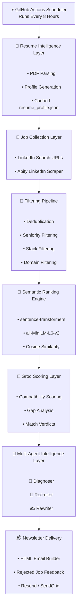

# 🎯 AI Job Newsletter Agent 

<div align="center">


### AI-powered career intelligence system for automated job discovery, semantic ranking, ATS analysis, recruiter evaluation, and resume optimization.

</div>

---

# 🚀 What This Project Does

This system automatically:

1. Scrapes fresh jobs from LinkedIn using Apify
2. Removes irrelevant/senior/wrong-stack roles
3. Uses local embeddings to rank jobs against your resume
4. Uses Groq LLMs to score job compatibility
5. Runs a multi-agent intelligence layer for strong matches
6. Explains rejected or low-scoring jobs
7. Sends a polished HTML newsletter directly to your inbox

The entire pipeline runs automatically every 8 hours using GitHub Actions.

---

# ✨ Features

- ✅ Scrapes fresh LinkedIn jobs from the last 12 hours
- ✅ Runs automatically every 8 hours via GitHub Actions
- ✅ Multi-location support:
  - Pune
  - Bangalore
  - Hyderabad
  - Remote India
- ✅ Local semantic similarity ranking using `all-MiniLM-L6-v2`
- ✅ Resume parsed dynamically from PDF
- ✅ Resume profile caching (`resume_profile.json`)
- ✅ Groq-powered compatibility scoring
- ✅ Strict filtering to avoid irrelevant jobs
- ✅ Multi-agent intelligence system:
  - 🔬 Diagnoser
  - 👔 Recruiter
  - ✍️ Rewriter
- ✅ ATS keyword analysis
- ✅ Tailored resume rewrites using Google XYZ formula
- ✅ Rejected jobs feedback section
- ✅ HTML email newsletter with intelligence insights inline
- ✅ Nearly zero-cost infrastructure

---

# 🏗️ High-Level Architecture

<div align="center">



</div>

---

# 🧠 Intelligence Layer Explained

The project contains a multi-agent AI intelligence system.

These agents only run for high-quality jobs that cross the `MIN_SCORE` threshold.

This keeps Groq usage low while improving personalization.

---

## 🔬 Diagnoser Agent

Acts like an ATS system.

### Responsibilities

- Calculates ATS compatibility score
- Finds missing keywords
- Detects weak resume areas
- Identifies strong alignment areas
- Generates ATS verdict

### Example Output

```json
{
  "ats_score": 82,
  "missing_keywords": [
    "Azure Data Factory",
    "CI/CD"
  ],
  "weak_areas": [
    "Limited cloud deployment exposure"
  ]
}
```

---

## 👔 Recruiter Agent

Acts like a senior technical recruiter.

### Responsibilities

- Compares candidate vs industry expectations
- Finds commonly required missing skills
- Identifies differentiators
- Suggests quick-win improvements

### Example

```json
{
  "role_fit_score": 78,
  "quick_wins": [
    "Add Docker deployment project",
    "Improve cloud exposure"
  ]
}
```

---

## ✍️ Rewriter Agent

Acts like an expert resume writer.

### Responsibilities

- Rewrites experience bullets
- Uses Google XYZ formula
- Injects ATS keywords naturally
- Tailors resume toward target role
- Preserves honesty and structure

### Example Rewrite

```text
- Improved ETL pipeline reliability by 35% by implementing Kafka retry handling and monitoring workflows.
```

---

# 🖼️ Newsletter UI Preview

The generated newsletter contains rich intelligence sections for each qualifying job.

## Included Sections

### Main Job Card

- Match score
- Match verdict
- Experience requirement
- Skill gaps
- Match reasons
- Apply links

---

### ATS Diagnosis

Shows:

- ATS score
- Weak areas
- Missing keywords
- Resume strengths
- ATS verdict

---

### Recruiter Analysis

Shows:

- Industry expectation gaps
- Commonly required skills
- Candidate differentiators
- Quick-win recommendations

---

### Tailored Resume

Shows:

- AI-rewritten resume bullets
- Google XYZ optimized content
- ATS keyword incorporation

---

### Rejected Jobs Feedback

The newsletter also includes jobs that were rejected or scored below threshold.

This helps avoid missing potentially useful opportunities.

Each rejected job includes:

- Compatibility score
- Rejection reason
- Biggest gap
- Similarity score
- Quick review link

Example:

```text
IT&D Data Engineer — 65/100
Reason: Missing FastAPI experience
Verdict: Close match but below threshold
```

This creates a feedback loop instead of silently discarding jobs.

---

# 📂 Project Structure

```text
.
├── job_agent.py
├── email_sender.py
├── embedder.py
├── resume_parser.py
├── resume_profile.py
├── resume_profile.json
├── requirements.txt
├── resumes/
│   └── latest_resume.pdf
└── .github/
    └── workflows/
        └── job_newsletter.yml
```

---

# ⚙️ Full Pipeline Walkthrough

---

## 1️⃣ Resume Intelligence Generation

The resume PDF is parsed locally.

The system generates a structured profile including:

- Skills
- Primary roles
- Certifications
- Preferred domains
- Core strengths
- Education
- Locations

The generated profile is cached as:

```text
resume_profile.json
```

This avoids unnecessary LLM calls.

---

## 2️⃣ LinkedIn Job Collection

The system uses:

- LinkedIn search URLs
- Apify LinkedIn Jobs Scraper

Fresh jobs from the last 12 hours are collected.

Supported searches include:

- Data Engineer
- Backend Engineer
- Python FastAPI
- Associate Data Engineer

Across:

- Pune
- Bangalore
- Hyderabad
- Remote India

---

## 3️⃣ Filtering Pipeline

Before any AI scoring happens, jobs are aggressively filtered.

### Filters Include

#### Seniority Filtering

Rejects:

```text
senior
lead
principal
staff
architect
manager
director
vp
```

---

#### Wrong Stack Filtering

Rejects jobs containing:

```text
java
springboot
.net
php
android
ios
golang
react native
```

---

#### Domain Filtering

Rejects:

```text
data scientist
ml engineer
ai engineer
devops engineer
qa engineer
frontend engineer
```

---

#### Positive Role Matching

Requires at least one target role:

```text
backend engineer
python engineer
data engineer
platform engineer
```

This dramatically reduces semantic drift.

---

## 4️⃣ Semantic Similarity Ranking

The project uses:

```text
sentence-transformers/all-MiniLM-L6-v2
```

### Pipeline

1. Resume converted into embedding vector
2. Job descriptions converted into embeddings
3. Cosine similarity calculated
4. Top matching jobs selected

Only the top jobs proceed to LLM scoring.

This minimizes API usage and improves relevance.

---

# 🤖 Groq Scoring System

The scorer evaluates:

- Tech stack alignment
- Seniority alignment
- Domain relevance
- Experience expectations
- Semantic similarity score

### Example

```json
{
  "score": 79,
  "verdict": "Moderate Match",
  "gap": "Azure Data Factory"
}
```

---

# 📬 Newsletter System

The HTML newsletter contains:

- Ranked jobs
- Match scores
- ATS analysis
- Missing skills
- Recruiter feedback
- Resume rewrites
- Apply links
- Rejected job explanations
- Close-match review section

Supported providers:

- Resend
- SendGrid

---

# ⚡ Workflow Scheduling

The workflow runs automatically every 8 hours.

This helps compensate for GitHub Actions scheduler delays and ensures fresh jobs are discovered before they become stale.

## Why Every 8 Hours?

GitHub Actions scheduled workflows are not guaranteed to start exactly on time.

A job scheduled for 8:00 AM may sometimes start at:

- 8:20 AM
- 9:00 AM
- 10:00 AM

depending on GitHub load.

Running every 8 hours improves reliability and reduces the chance of missing fresh postings.

---

## Current Schedule (IST)

| Run | IST Time |
|---|---|
| Run 1 | 5:30 AM IST |
| Run 2 | 1:30 PM IST |
| Run 3 | 9:30 PM IST |

---

## GitHub Actions Cron Configuration

```yaml
on:
  schedule:
    # 5:30 AM IST
    - cron: "0 0 * * *"

    # 1:30 PM IST
    - cron: "0 8 * * *"

    # 9:30 PM IST
    - cron: "0 16 * * *"

  workflow_dispatch:
```

---

# 🛠️ Setup Guide

---

## Step 1 — Create GitHub Repository

Create a private GitHub repository.

Upload all project files.

---

## Step 2 — Upload Resume

Place your resume PDF here:

```text
resumes/latest_resume.pdf
```

---

## Step 3 — Configure Secrets

Go to:

```text
GitHub Repo → Settings → Secrets and variables → Actions
```

Add:

| Secret | Description |
|---|---|
| `APIFY_TOKEN` | Apify token |
| `GROQ_API_KEY` | Groq API key |
| `RECIPIENT_EMAIL` | Receiver email |
| `SENDER_EMAIL` | Verified sender |
| `EMAIL_API_KEY` | Resend/SendGrid API key |
| `EMAIL_PROVIDER` | resend / sendgrid |
| `MIN_SCORE` | Minimum score threshold |
| `TOP_N` | Number of jobs in newsletter |
| `EMBEDDING_TOP_N` | Number of jobs sent to Groq |
| `REGENERATE_RESUME` | true / false |
| `CANDIDATE_EXPERIENCE` | Actual experience |
| `CANDIDATE_SENIORITY` | junior / mid |

---

# 🔍 Understanding `TOP_N`

`TOP_N` controls:

> How many final qualifying jobs appear in the email newsletter.

Example:

```env
TOP_N=5
```

Even if 20 jobs qualify:

- Only top 5 highest-scoring jobs are emailed.

This keeps newsletters concise and avoids unnecessary intelligence-layer cost.

---

# 🔍 Understanding `EMBEDDING_TOP_N`

Controls:

> How many semantically ranked jobs proceed to Groq scoring.

Example:

```env
EMBEDDING_TOP_N=10
```

Pipeline:

```text
200 scraped jobs
→ 20 filtered jobs
→ Top 10 semantic matches
→ Groq scoring
→ Final top jobs
```

This massively reduces LLM usage.

---

# 💰 Estimated Monthly Cost

| Service | Cost |
|---|---|
| GitHub Actions | Free |
| Groq | Free |
| Apify | Free Tier |
| Resend | Free |
| Embeddings | Local |
| Total | ~₹0/month |

---

# 🧱 Tech Stack

| Layer | Technology |
|---|---|
| Scraping | Apify |
| Embeddings | sentence-transformers |
| LLM | Groq |
| Email | Resend / SendGrid |
| Automation | GitHub Actions |
| PDF Parsing | PyMuPDF |
| Language | Python 3.11 |

---

# 📈 Example Workflow Logs

```text
Retrieved 200 raw jobs
After dedup: 20 jobs
Prefiltered to 2 relevant jobs

Top semantic matches:
0.446 → 0.521

Scoring jobs with Groq...

79/100 → QUALIFIES
65/100 → REJECTED

Running intelligence layer...

Diagnoser complete
Recruiter complete
Rewriter complete

Newsletter sent successfully
```

---

# 🧯 Troubleshooting

---

## No Jobs Found

Possible reasons:

- Filters too strict
- Wrong search URLs
- Market slowdown
- Seniority mismatch

---

## Groq Rate Limits

Reduce:

```env
EMBEDDING_TOP_N=5
```

Or increase delay between requests.

---

## Wrong Jobs Ranked

- Regenerate resume profile
- Improve filtering keywords
- Update experience level secrets

---

## Missing `resume_profile.json`

Set:

```env
REGENERATE_RESUME=true
```

Run workflow once manually.

Then set back to:

```env
false
```

---

# 🔮 Planned Improvements

- Indeed Apify integration
- Naukri Apify integration
- Telegram notifications
- Slack integration
- Persistent seen-job tracking
- AI-generated cover letters
- Historical analytics dashboard
- Resume variants
- Feedback learning loop

---

# 📄 License

MIT License

---

<div align="center">

### Built with ❤️ using Local Embeddings + Groq + GitHub Actions

#### Smarter · Faster · Nearly Free Job Hunting

</div>
